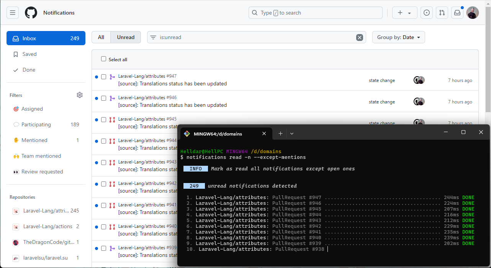
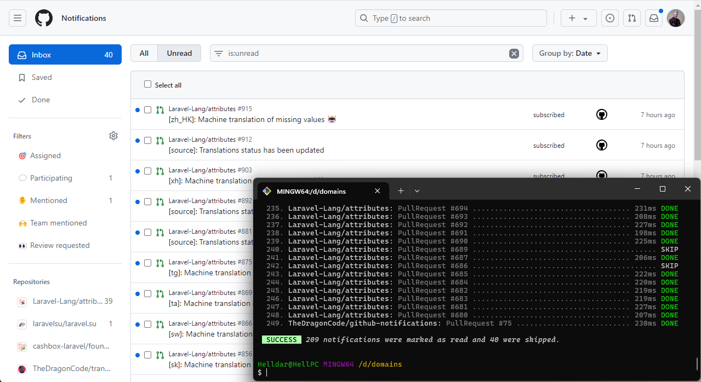

# GitHub Notifications


[![Stable Version][badge_stable]][link_packagist]
[![Unstable Version][badge_unstable]][link_packagist]
[![Total Downloads][badge_downloads]][link_packagist]
[![Github Workflow Status][badge_build]][link_build]
[![License][badge_license]][link_license]

> GitHub Notifications was created by, and is maintained by `The Dragon Code`,
> and is a simple command line tool to mark all notifications about issues or rejected PRs as read on a given
> organization.

## Installation

PHP 8.2+ is required. To get the latest version, simply require the project using [Composer](https://getcomposer.org):

```Bash
composer global require dragon-code/github-notifications:*
```

Alternatively, you can simply clone the repo and run `composer install` in the folder.

## Update global dependencies

To update global dependencies, use the console command:

```Bash
composer global update
```

## Authentication

You'll also need to create yourself a
[personal access token](https://github.com/settings/tokens/new?description=Notifications%20Reader)
for GitHub's API with access to the `notifications` scope.

## Usage

By default, we'll try and read your personal access token for GitHub from the `GITHUB_TOKEN` environment variable,
however you can also specify a token with the `--token` command-line flag.

To read all issue notifications:

```Bash
notifications read
```

To clear all issue notifications for the Laravel organization:

```Bash
notifications read laravel
```

Or, if you are specifying a token:

```Bash
notifications read laravel --token {...}
```

In addition to the organization, you can also specify the full or partial name of the repository. For example:

```Bash
notifications read laravel/framework
# or
notifications read laravel/fra
# or
notifications read la
```

You can also specify several names:

```Bash
notifications read laravel/framework laravel/jet
```

When determining the name, the [`str_starts_with`](https://www.php.net/manual/en/function.str-starts-with) function is
used.

### Options

By default, only those Issues and Pull Requests that have been closed or merged are marked as read.

But you can define the parameters yourself:

```Bash
-i, --except-issues     Exclude issues from processing
-p, --except-pulls      Exclude Pull Requests from processing
-m, --except-mentions   Exclude notifications with your mention from processing
-o, --with-open         Process including open Issues and Pull Requests
-n, --no-interaction    Do not ask any interactive question
-q, --quiet             Do not output any message
```

For example:

```Bash
# except issues + with open
notifications read qwerty -ion
```

With this set of options, notifications that have:

- whose repository name begins with the word `qwerty`
- Pull Requests only, both open and closed
- will not be asked to continue in the console

> You can call the console command to display help information:
>
> ```bash
> notifications read --help
> ```

## Result

### Before

Execute a console command with the following parameters:

```Bash
notifications read -n --except-mentions
```



### After



### After with `--with-open` option

Execute a console command with the following parameters:

```Bash
notifications read -n --except-mentions --with-open
```


## Support Us

❤️ The Dragon Code? Please consider supporting our collective on [Boosty](https://boosty.to/dragon-code).

## License

This package is licensed under the [MIT License](LICENSE).

[badge_build]:          https://img.shields.io/github/actions/workflow/status/TheDragonCode/github-notifications/tests.yml?style=flat-square

[badge_downloads]:      https://img.shields.io/packagist/dt/dragon-code/github-notifications.svg?style=flat-square

[badge_license]:        https://img.shields.io/packagist/l/dragon-code/github-notifications.svg?style=flat-square

[badge_stable]:         https://img.shields.io/github/v/release/TheDragonCode/github-notifications?label=stable&style=flat-square

[badge_unstable]:       https://img.shields.io/badge/unstable-dev--main-orange?style=flat-square

[link_build]:           https://github.com/TheDragonCode/github-notifications/actions

[link_license]:         LICENSE

[link_packagist]:       https://packagist.org/packages/dragon-code/github-notifications
